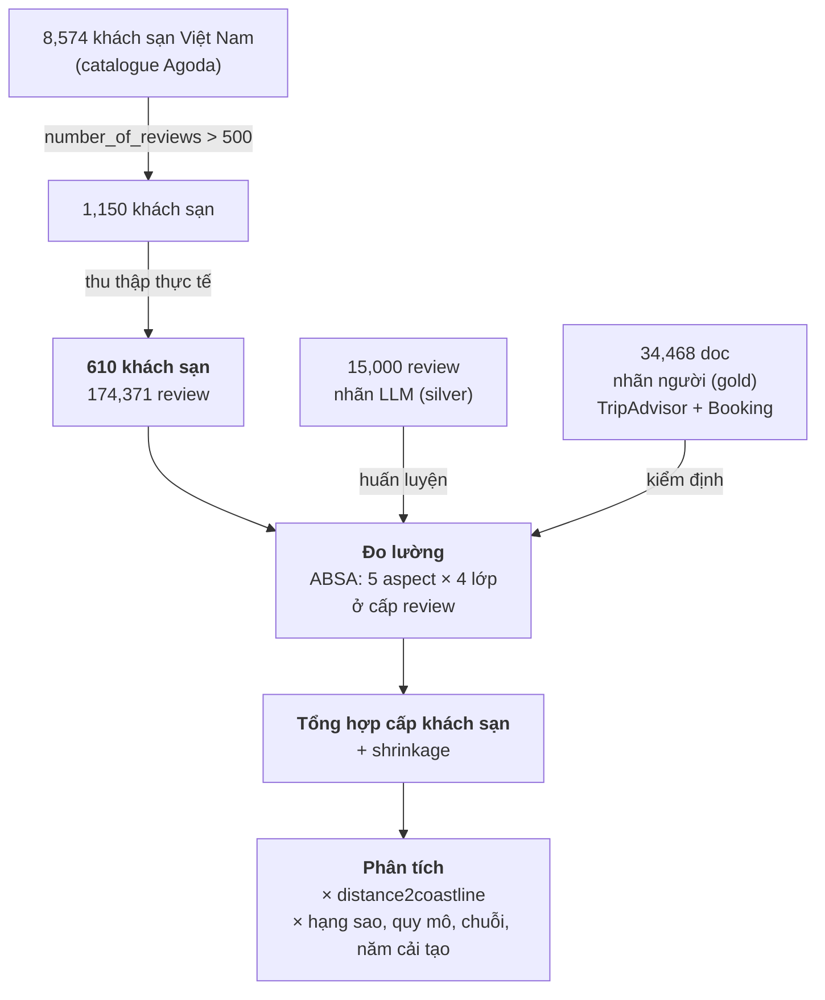

# Methodology — thiết kế phần Phương pháp cho paper

Tài liệu thiết kế, không phải bản thảo cuối. Mọi con số đã kiểm chứng trực tiếp từ
`data/hotel_reviews.db` (ghi rõ truy vấn ở §9). Chỗ nào chưa có dữ liệu thì đánh
dấu 🔲 chứ không viết bừa.

Ngày: 2026-08-05 · Nguồn số: [RESULTS_MODEL_B.md](../markdown/RESULTS_MODEL_B.md)

Viết bằng tiếng Việt để bạn duyệt; sau khi chốt các 🔶 decision point tôi có thể
dựng thành prose tiếng Anh cho paper.

---

## 0. ⚠️ Phát hiện chặn: corpus **không** được lọc theo ven biển

Tên dự án là *coastal-hotel*, nhưng 610 khách sạn trong corpus **không hề được lọc
theo khoảng cách bờ biển**:

| thống kê `distance2coastline` (km), n = 610 | |
|---|---|
| min | 0.0 |
| q25 | **0.49** |
| **median** | **44.68** |
| q75 | 72.97 |
| p90 | 98.37 |
| max | **369.33** (Sapa) |
| ≤ 5 km | **208 (34 %)** |
| ≤ 10 km | 210 (34 %) |

Phân bố **lưỡng cực**, không phải một mẫu ven biển:

| thành phố | n | d (km) | loại |
|---|---|---|---|
| Ho Chi Minh City | 176 | 45.3 | đô thị nội địa |
| Hanoi | 116 | 99.0 | đô thị nội địa |
| Da Nang | 59 | 1.0 | ven biển |
| Nha Trang | 43 | 0.1 | ven biển |
| Hoi An | 39 | 3.5 | ven biển |
| Dalat | 29 | 72.7 | cao nguyên |
| Vung Tau | 29 | 0.3 | ven biển |
| Sapa | 13 | 369.0 | miền núi |

**Hai phần ba mẫu là khách sạn nội địa.** Nếu paper tự nhận là nghiên cứu về khách
sạn ven biển thì đó là mô tả sai mẫu — và là thứ reviewer sẽ phát hiện ngay khi
nhìn bảng mô tả.

### 🔶 Decision point 1 — cách xử lý (quan trọng nhất trong tài liệu này)

| | A. Lọc ven biển | **B. Thiết kế gradient** ⭐ | C. So sánh nhị phân |
|---|---|---|---|
| Mẫu | 208 ks ≤ 5 km | **toàn bộ 610** | 208 vs 402 |
| Biến độc lập | — | `distance2coastline` liên tục | coastal (0/1) |
| Câu hỏi | "khách nói gì về ks ven biển?" | **"khoảng cách tới biển làm đổi điều gì?"** | "ven biển khác nội địa ra sao?" |
| Điểm mạnh | đúng tên đề tài | **có nhóm đối chứng sẵn**, đủ biến thiên 0–369 km | dễ hiểu, dễ trình bày |
| Điểm yếu | mất 2/3 dữ liệu, không có đối chứng | phải kiểm soát confound (bên dưới) | mất thông tin liên tục |

**Tôi khuyến nghị B.** Lý do: chỉ nghiên cứu khách sạn ven biển thì không thể nói
điều gì *đặc thù* cho ven biển — không có gì để so. Có sẵn Sapa (369 km, núi) và
Nha Trang (0.1 km, biển) trong cùng một corpus là điều kiện nhận dạng mà thiết kế
A vứt bỏ. Tên đề tài đổi thành *"khoảng cách tới biển và trải nghiệm lưu trú"* thì
mạnh hơn hẳn.

**Confound bắt buộc phải kiểm soát nếu chọn B:** khoảng cách bờ biển gắn chặt với
**loại điểm đến** — Hà Nội/HCM là đô thị công vụ, Đà Nẵng/Nha Trang là nghỉ dưỡng
biển, Sapa/Đà Lạt là nghỉ dưỡng núi. Hồi quy thô theo khoảng cách sẽ trộn "ven
biển" với "nghỉ dưỡng vs công tác". Xem §7.3.

---

## 1. Tổng quan thiết kế



**Vai trò của mô hình:** Model B là **dụng cụ đo**, không phải đóng góp của paper.
Chuẩn nó cần đạt là *đủ tin cậy để rút kết luận*, không phải *state-of-the-art*.
Phần 6 tồn tại để chứng minh điều đó.

---

## 2. Bối cảnh và khung mẫu

### 2.1 Phễu chọn mẫu

| bước | n | tiêu chí |
|---|---|---|
| Catalogue khách sạn VN | 8,574 | toàn bộ Agoda VN, 41 trường |
| Có đủ review | **1,150** | `number_of_reviews > 500` |
| Thu thập thành công | **610** | có ≥ 1 review trên GMap hoặc Agoda |

🔲 **Cần bổ sung:** vì sao 1,150 → 610? (giới hạn scraping, không khớp tên, hết
hạn URL…). Reviewer sẽ hỏi tỉ lệ rụng 47 % này. Nếu rụng không ngẫu nhiên — ví dụ
khách sạn nhỏ khó khớp hơn — thì đó là **selection bias** phải nêu.

### 2.2 Đặc trưng khách sạn (n = 610)

| | |
|---|---|
| Hạng sao trung bình | 3.49 |
| Số phòng trung bình | 99 |
| Khoảng cách bờ biển | median 44.7 km (0–369) |

---

## 3. Thu thập dữ liệu

Hai nguồn, thu bằng Playwright (chi tiết: [SCRAPING-TECHNIQUE.md](../markdown/SCRAPING-TECHNIQUE.md)):

| nguồn | review | khách sạn | trường thời gian |
|---|---|---|---|
| Google Maps | 112,242 | 417 | `review_year` 2009–2026 |
| Agoda | 62,129 | 314 | `stay_year` 2004–2024 |
| **tổng** | **174,371** | **610 (hợp)** | |

**Ngôn ngữ gần cân bằng** — en 89,163 (51.1 %) · vi 85,208 (48.9 %). Đây là lý do
kỹ thuật để dùng encoder đa ngữ, và là cơ sở cho phân tích tách theo ngôn ngữ.

🔲 **Ethics/ToS:** cần một đoạn về thu thập dữ liệu công khai, không thu thập
thông tin định danh cá nhân, và tuân thủ điều khoản nền tảng. Tạp chí tourism
ngày càng yêu cầu mục này.

---

## 4. Đo lường — Aspect-Based Sentiment Analysis

### 4.1 Bộ khung aspect

**5 macro aspect**, mỗi cái 4 lớp (`not_mentioned` · `negative` · `neutral` · `positive`):

`facility` · `amenity` · `service` · `experience` · `loyalty`

Dưới đó **34 sub-aspect** (7/8/8/8/3). 🔲 Cần mô tả bộ khung này được xây từ đâu —
quy nạp từ topic modeling, hay diễn dịch từ thang đo có sẵn (SERVQUAL,
HOLSERV…)? Tạp chí tourism sẽ đòi neo vào lý thuyết.

> ⚠️ **`amenity` không phải một aspect mạch lạc.** Nó gộp 8 sub-aspect có tỉ lệ chê
> từ **5.7 %** (`local_convenience`) tới **85.8 %** (`payment_billing`) — và đây
> đúng là aspect yếu nhất của mô hình (0.513). Đáng lưu ý hơn: **`coastal_access`
> (1,286 dòng) nằm trong đó** — tức biến quan trọng nhất của thiết kế B lại nằm
> trong nhóm đo kém nhất. Xem §6.5 và 🔶 decision point 3.

### 4.2 Gán nhãn hỗ trợ bởi LLM (silver)

- **15,000 review** được `claude-sonnet-5` gán qua Batch API → `REVIEW_ASPECTS`
  (72,842 dòng aspect), mỗi dòng có `sub_aspect`, `sentiment`, và **evidence span
  trích nguyên văn** (`evidence_valid` = 99.6 %).
- Span được định vị về câu → `SENTENCE_LABELS` (đơn vị huấn luyện).
- `not_mentioned` **được suy ra**, không được gán: nếu không span nào của aspect
  đó chạm câu thì nhãn là `not_mentioned`. Đã kiểm chứng độ trung thực của phép
  suy ra: **99.72 %** (chỉ 133/46,770 cặp bị mất).

### 4.3 Bộ phân loại (Model B)

| | |
|---|---|
| Encoder | `xlm-roberta-base` (278 M), token CLS + dropout 0.1 |
| Heads | 5 × `Linear(768, 4)` song song |
| Loss | Σ cross-entropy trên 5 head |
| Huấn luyện | 10 epoch · batch 32 · lr 2e-5 · AdamW · max_len 128 |
| Chọn checkpoint | val macro-F1 cao nhất trên silver val |
| Phần cứng | NVIDIA RTX 3060 |
| Cấu hình dùng | **`no_weights`** (không class weighting) |

### 4.4 Tổng hợp câu → review

Mô hình huấn luyện ở cấp **câu** nhưng phân tích ở cấp **review**:

- **Hiện diện:** aspect được coi là có mặt nếu **bất kỳ** câu nào gán nhãn khác
  `not_mentioned`.
- **Sắc thái:** đa số phiếu trên các câu đó; hoà → `negative`.

Hoà nghiêng về `negative` là lựa chọn có chủ đích: trong bối cảnh quản trị khách
sạn, bỏ sót một lời phàn nàn tốn kém hơn một cảnh báo giả.

---

## 5. Chuẩn vàng do người gán

| bộ | ngôn ngữ | n | dev | test |
|---|---|---|---|---|
| TripAdvisor EN | en | 9,867 | 3,455 | 6,412 |
| TripAdvisor VN | **vi** | 17,624 | 6,159 | 11,465 |
| Booking | en | 6,977 | 2,441 | 4,536 |
| **tổng** | | **34,468** | **12,055** | **22,413** |

Chia 35/65 theo seed cố định 20260724, phân tầng theo aspect-presence.
`VALIDATE-test` **đóng băng, chưa từng được đọc**.

**Điểm mạnh của thiết kế:** gold đến từ **nền tảng khác** với dữ liệu huấn luyện
(TripAdvisor/Booking vs GMap/Agoda) — nên nó đồng thời là phép kiểm **khái quát
hoá xuyên nền tảng**, không chỉ là kiểm tra nội bộ.

---

## 6. Kiểm định dụng cụ đo

### 6.1 Đồng thuận với nhãn người (`VALIDATE-dev`, 12,055 doc)

| cấu hình | en | vi | all |
|---|---|---|---|
| **`no_weights`** ⭐ | 0.579 | 0.584 | **0.584** |
| `aug_no_weights` | 0.577 | 0.586 | 0.582 |
| `baseline` | 0.557 | 0.564 | 0.562 |
| `augmented` | 0.550 | 0.552 | 0.553 |
| `frozen` | 0.477 | 0.482 | 0.481 |

Theo aspect (`no_weights`): service 0.653 · loyalty 0.654 · facility 0.618 ·
amenity 0.513 · experience 0.483.

> **Cách trình bày quan trọng hơn con số.** 0.584 là macro-F1 4 lớp, bị kéo xuống
> bởi lớp `neutral` mà chính chúng ta tuyên bố không học được. Phân rã ra:
>
> | tầng | giá trị |
> |---|---|
> | **phát hiện aspect** (nhị phân) | **0.873** |
> | **phân cực** neg/pos (điều kiện đã phát hiện đúng) | **0.888** |
> | end-to-end 3 lớp {nm, neg, pos} | **0.721** |
> | 4 lớp (đang báo cáo) | 0.569 |
>
> Cặp (0.873 / 0.721) mô tả dụng cụ đo trung thực hơn hẳn con số đơn 0.584.
> *(Số phân rã tính trên arm 3-epoch; cần tính lại cho bản hội tụ.)*

### 6.2 Ablation (đã đăng ký trước)

Lưới 2 × 2 đầy đủ, trên nhãn người:

| | class weights ON | class weights OFF |
|---|---|---|
| không augmentation | 0.562 | **0.584** |
| có augmentation | 0.553 | 0.582 |

Hai hiệu ứng nhất quán cả chiều lẫn độ lớn giữa silver và gold:
tắt weights **+0.022/+0.029**; augmentation **−0.009/−0.002**.

Fine-tuning vs linear probe trên encoder đóng băng: **0.584 vs 0.481**.

### 6.3 🔲 Độ tin cậy — CHƯA CÓ, và nó CHẶN

Bộ κ đã rút đúng chuẩn (**500 doc, 250 en + 250 vi, toàn bộ từ partition test**)
nhưng **chưa ai gán**. Cho tới lúc đó:

> Mọi F1 đo **mức đồng thuận với phán đoán của một cá nhân**, không phải với một
> chuẩn đồng thuận đã kiểm chứng. Cả 34,468 document mang đúng một annotation từ
> một annotator id, không có adjudication nào được ghi lại.

Đây là mục **số một** phải hoàn thành trước khi nộp.

### 6.4 🔲 Baseline — CHƯA CÓ, và nó cũng CHẶN

Hiện có **không** baseline nào. Tối thiểu cần:

| baseline | trả lời | chi phí |
|---|---|---|
| majority-class | "hơn không làm gì" | ✅ đã tính: **0.186** |
| **zero-shot LLM** ⭐ | **"sao không dùng thẳng ChatGPT?"** | ~$3 |
| PhoBERT (đơn ngữ) | "đa ngữ có đúng lựa chọn?" | ~10 phút GPU |

Cái ⭐ là câu reviewer tourism **chắc chắn** sẽ hỏi, và nó cũng cho **trần** (ceiling)
để đọc mọi con số khác.

### 6.5 Giới hạn đã biết của dụng cụ đo

Nêu thẳng trong paper, đừng để reviewer tìm ra:

1. **Chưa có κ** → mọi số là provisional.
2. **`neutral` gần như không học được** (F1 0.00–0.21) — ~3 % dữ liệu huấn luyện,
   `loyalty/neutral` chỉ có 15 dòng.
3. **`amenity` yếu** (0.513) vì taxonomy không mạch lạc, không phải vì mô hình.
4. **`not_mentioned` là hai khái niệm khác nhau** giữa train (suy ra từ việc
   teacher không tìm thấy) và validate (người khẳng định vắng mặt).
5. **Lệch độ dài văn bản xuyên nền tảng** — train 2.84 câu/doc, validate 4.64;
   luật hiện-diện-OR biến chênh lệch này thành false positive cấp document.
6. **Nhãn huấn luyện do LLM sinh** — thiên lệch của nó bị *giới hạn*, không bị
   *loại bỏ*, bởi phép kiểm xuyên nền tảng.

---

## 7. Chiến lược phân tích

### 7.1 Tổng hợp cấp khách sạn — bắt buộc có shrinkage

Số review mỗi khách sạn **rất lệch**:

| min | q25 | median | q75 | max | < 50 review |
|---|---|---|---|---|---|
| 1 | 129 | 275 | 385 | 1,464 | **58 ks** |

Tỉ lệ thô sẽ khiến khách sạn ít review chiếm hết hai đầu bảng xếp hạng. Dùng
**empirical-Bayes shrinkage** co về trung bình chung, hoặc mô hình đa tầng với
intercept ngẫu nhiên theo khách sạn. 🔶 Chọn ngưỡng tối thiểu (đề xuất: **≥ 30
review**, loại 58 ks) và nêu rõ.

### 7.2 Biến

**Phụ thuộc** — theo từng aspect, cấp khách sạn:
- tỉ lệ hiện diện (aspect được nhắc trong bao nhiêu % review)
- tỉ lệ chê trong số review có nhắc

**Độc lập chính:** `distance2coastline` (liên tục, cân nhắc log vì lệch mạnh)

**Kiểm soát** (đều có sẵn trong bảng `HOTEL`):
`star_rating` · `numberrooms` · `accommodation_type` · `yearopened` ·
`yearrenovated` · `chain_name` · `city`/`state`

**Kiểm soát mục đích chuyến đi** — 🔲 vấn đề:

| trường | độ phủ |
|---|---|
| Agoda `group_type` | **tốt** (cặp đôi 24,729 · một mình 11,119 · gia đình 12,197 · nhóm 7,819 · công tác 6,255) |
| GMap `tag_trip_type` | **81 % thiếu** (90,716/112,242 NULL) |

Nên biến kiểm soát mục đích chuyến đi chỉ dùng được cho phần Agoda. Hoặc phân
tích tách theo nguồn, hoặc chấp nhận thiếu và nêu là giới hạn.

### 7.3 Mô hình

🔶 **Decision point 2 — đơn vị phân tích**

| | cấp review (n ≈ 174k) | cấp khách sạn (n = 610) |
|---|---|---|
| Ưu | công suất lớn, dùng được biến cấp review | khớp với biến giải thích (đặc trưng khách sạn) |
| Nhược | quan sát lồng trong khách sạn → phải dùng mô hình đa tầng | mất biến thiên nội bộ |

**Khuyến nghị: mô hình đa tầng** (review lồng trong khách sạn) — giữ được cả hai,
và là chuẩn mực trong tạp chí hospitality.

**Xử lý confound điểm đến (§0):** khoảng cách bờ biển gắn với loại điểm đến. Ba
cách, nên làm cả ba và báo cáo cùng nhau:

1. Thêm biến kiểm soát **loại điểm đến** (đô thị / biển / núi), mã hoá từ `city`
2. Fixed effects theo `state`, để hiệu ứng nhận dạng **trong nội bộ** từng tỉnh
3. So sánh ghép cặp: khách sạn cùng hạng sao / quy mô, khác khoảng cách

🔶 **Decision point 3 — `coastal_access` ở tầng nào**

Biến giá trị nhất cho câu hỏi nghiên cứu là sub-aspect `coastal_access`, nhưng
tầng sub-aspect **không có gold, không kiểm định được**. Hai lựa chọn:

- **(a)** Phân tích ở tầng macro `amenity` — kiểm định được, nhưng aspect này
  trộn 8 thứ không liên quan và là aspect yếu nhất.
- **(b)** Phân tích ở tầng `coastal_access`, ghi rõ đây là **tầng exploratory**
  theo two-tier rule, kèm disclaimer.

*(Có một hướng thứ ba: tách `amenity` thành 2–3 head mạch lạc — trong đó
`location & access` chứa `coastal_access` — rồi kiểm định bằng cách OR ngược về
`amenity` để so với gold hiện có. ~15 phút GPU. Xem REVIEW §4.1.)*

🔲 Kiểm tra bắt buộc trước khi rút kết luận so sánh: **độ chệch vi sai**. Chệch cố
định thì triệt tiêu khi so sánh; chệch vi sai thì không. Đã biết độ dài review ảnh
hưởng tới phát hiện hiện diện — nên phải hồi quy độ dài review theo
`distance2coastline` và các biến kiểm soát. Có tương quan thì phải đưa độ dài vào
mô hình.

---

## 8. Tái lập

Toàn bộ pipeline có mã nguồn, seed cố định, và phân vùng bất biến lưu trong DB.
🔲 Cân nhắc công bố: mã nguồn + bộ khung aspect + nhãn silver. Không công bố được
văn bản review thô (điều khoản nền tảng).

---

## 9. Việc phải làm trước khi viết bản thảo

| ưu tiên | việc | chặn? | phụ thuộc người |
|---|---|---|---|
| 1 | 🔶 **Chốt decision point 1** (định nghĩa ven biển) | ✅ chặn toàn bộ | không |
| 2 | 🔲 **κ** — 500 doc đã rút, cần annotator thứ hai | ✅ chặn | ⚠️ **có** |
| 3 | 🔲 **Baseline zero-shot LLM** (~$3) + majority | ✅ chặn | không |
| 4 | 🔲 Giải thích rụng mẫu 1,150 → 610 | ✅ chặn | không |
| 5 | 🔶 Chốt xử lý `neutral` — **trước khi đọc test** | ✅ chặn | không |
| 6 | 🔲 Nguồn gốc lý thuyết của bộ khung 5 aspect | quan trọng | không |
| 7 | 🔲 Gold in-domain GMap/Agoda 300–500 doc | quan trọng | ⚠️ có |
| 8 | 🔲 Mục Ethics/ToS | quan trọng | không |
| 9 | 🔶 Decision point 2 & 3 | | không |
| 10 | 🔲 Kiểm tra chệch vi sai theo độ dài review | | không |

**Hai việc phụ thuộc người (2 và 7) phải khởi động ngay** — chúng dài nhất và
không mua được bằng compute.

---

## Phụ lục — nguồn số

```sql
-- corpus
SELECT count(*), count(DISTINCT hotel_id) FROM GOOGLEMAPS_REVIEW;   -- 112242, 417
SELECT count(*), count(DISTINCT hotel_id) FROM AGODA_REVIEW;        -- 62129, 314
SELECT count(DISTINCT hotel_id) FROM (
  SELECT hotel_id FROM GOOGLEMAPS_REVIEW UNION SELECT hotel_id FROM AGODA_REVIEW); -- 610

-- khoang cach bo bien cua mau
SELECT median(distance2coastline), sum(CASE WHEN distance2coastline<=5 THEN 1 ELSE 0 END)
FROM HOTEL WHERE hotel_id IN (
  SELECT hotel_id FROM GOOGLEMAPS_REVIEW UNION SELECT hotel_id FROM AGODA_REVIEW);

-- do phu review moi khach san
SELECT median(n) FROM (SELECT hotel_id,count(*) n FROM (
  SELECT hotel_id FROM GOOGLEMAPS_REVIEW UNION ALL SELECT hotel_id FROM AGODA_REVIEW) GROUP BY 1);
```

Kết quả mô hình: `ABSA_EVAL_RESULTS` · `models/absa_b/*/config.json` ·
[RESULTS_MODEL_B.md](../markdown/RESULTS_MODEL_B.md)
